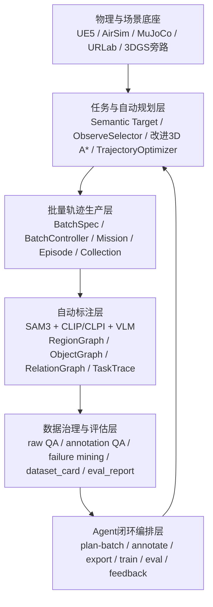

# AirSpark 低空智能主动数据框架技术报告

> [!summary] 技术定位
> **AirSpark 是面向城市低空无人机 VLN/VLA 与导航—操作任务的主动数据智能框架。它不是一个单纯的仿真环境、数据集或标注工具，而是一套把“场景、任务、轨迹、语义、物理真值、模型评估和失败反馈”组织成闭环的数据生产系统。**

本文重新聚焦技术内涵：AirSpark 如何以 UE5 + AirSim + MuJoCo 为物理底座，结合改进三维 A* 自动规划、批量轨迹生产、SAM3 + CLIP/CLPI + VLM 自动语义标注、轨迹过程标注、数据质量治理和 Agent/CLI 统一编排，构建一个可持续演化的低空主动数据框架。

---

## 0. 核心结论

AirSpark 当前应被理解为一个**低空智能主动数据操作系统**。它的关键价值不是“能飞一条路线”，也不是“能生成一些 episode”，而是形成以下闭环能力：

```text
任务目标与能力缺口
  → 自动规划与批量采集
  → 场景/轨迹/交互自动标注
  → QA、失败挖掘与数据卡片
  → 训练/评估
  → 反馈驱动下一轮主动补采
```

换句话说，AirSpark 的核心问题不是“采多少数据”，而是：

> **在给定模型弱项、任务目标、物理风险和标注成本的条件下，下一批最有边际价值的数据应该是什么，如何自动产生，如何自动标注，如何证明它确实提升能力。**

这也是“主动数据智能”区别于传统静态数据集、自动化采集脚本和普通仿真平台的关键。

---

## 1. AirSpark 的技术对象：低空 VLA 数据，而不是普通 UAV 日志

传统无人机数据通常记录图像、位姿、IMU、控制量和任务结果。AirSpark 面向的是更高一级的 **低空 VLA 数据**：它不仅要让模型看到世界，还要让模型理解“为什么这样飞、下一步要看哪里、哪个区域是错的、哪个目标可操作、失败发生在哪个阶段”。

因此，AirSpark 的数据对象至少包含六层：

| 层 | 数据内容 | 技术含义 |
|---|---|---|
| 物理层 | 位姿、速度、控制量、碰撞、接触、关节状态 | 提供可复现实验与操作成功真值 |
| 视觉层 | RGB、Depth、Segmentation、目标可见性 | 支撑 VLA 感知输入和开放词表标注 |
| 几何层 | Occupancy、可达空间、LOS、路径、观察点 | 支撑自动规划、失败归因和安全约束 |
| 语义层 | ObjectGraph、RegionGraph、RelationGraph | 让场景从“可渲染”变成“可理解” |
| 任务层 | instruction、target、subgoal、flight_intent、interaction_stage | 让轨迹从“运动日志”变成“过程监督” |
| 反馈层 | QA、failure_histogram、dataset_card、eval_report、feedback | 让数据可以被筛选、评估和回流 |

AirSpark 的高质量数据不是“图像 + 动作”的简单配对，而是**低空任务全过程的结构化监督**。

---

## 2. 总体架构：从仿真系统到主动数据系统

AirSpark 可分为六个技术层：



| 层级 | 目标 | 关键技术 |
|---|---|---|
| L0 物理与场景底座 | 提供可信的飞行、碰撞、接触和传感器环境 | UE5.7、AirSim、MuJoCoBackend、URLab、FLU 坐标、真实重建旁路 |
| L1 任务与自动规划 | 自动生成任务目标、观察点和安全路径 | 语义目标查询、LOS、改进 3D A*、多候选路径、轨迹平滑 |
| L2 批量轨迹生产 | 大规模、可复现、可失败重试的数据生产 | BatchSpec、BatchController、MissionDirector、Episode lifecycle |
| L3 自动标注 | 将场景和轨迹转化为可学习监督 | SAM3、CLIP/CLPI、VLM、Semantic Patch、TrajectoryAnnotator |
| L4 数据治理与评估 | 判断数据是否完整、可信、有训练价值 | validator、failure_miner、dataset_card、WRR/MUG/EE |
| L5 Agent 闭环编排 | 统一管理各层 CLI，完成主动补采和自进化 | plan-batch、feedback-mine、JSON 契约、质量门、安全门 |

---

## 3. L0：物理与场景底座

### 3.1 UE5 + AirSim + MuJoCo 的分工

AirSpark 的底座不是单一仿真器，而是三类能力的组合：

| 组件 | 职责 | 在主动数据中的价值 |
|---|---|---|
| UE5 | 场景、渲染、相机、语义组件、Monitor 前端 | 提供可视化世界和数据采集宿主 |
| AirSim | 无人机 API、传感器抽象、RPC、飞行控制接口 | 提供低空飞行与外部控制接口 |
| MuJoCo / URLab | 刚体、关节、接触、夹爪、机械臂和操作真值 | 提供接触任务的物理可信度 |

AirSpark 的设计重点是：**几何与物理真值不能交给 LLM 判定**。LLM/VLM 可以命名物体、生成语言、解释失败，但碰撞、区域归属、可达性、接触、抬升高度、支撑关系和操作成功必须由 UE/MuJoCo/几何规则提供。

### 3.2 坐标与数据真相源

AirSpark 主线使用 FLU 米制坐标，UE/C++ raw collection 是首写真相源。LeRobot、HDF5、WebDataset、RLDS 等都是下游导出格式，而不是原始事实来源。

这一点非常重要：主动数据闭环需要可靠的“事实锚点”。如果原始 episode、frame、action、event、sensor、annotation 不是同一套事实源，后续的失败挖掘和补采决策就会变成猜测。

### 3.3 真实重建与 3DGS 的角色

AirSpark 不应把 3DGS/点云/真实重建直接当作主仿真地图的替代品。更合理的技术角色是：

```text
真实场景采集 / 3DGS / 点云
  → Real2Spec：抽取场景结构、区域、对象、视觉外观、失败点
  → SceneSpec / SemanticMap
  → 接入同一套 AnnotationOps 与 BatchSpec
  → 形成 paired episode：真实观察 ↔ 仿真复现 ↔ 生成补齐
```

这样，真实数据承担“事实锚点”和“域差发现”的作用，仿真承担可控复现实验和长尾补齐的作用。

---

## 4. L1：任务生成与自动规划层

AirSpark 的自动规划不是简单调用一个路径规划器，而是从语义目标到可执行轨迹的完整链路。

### 4.1 任务目标表达

每个任务可由以下字段描述：

| 字段 | 含义 |
|---|---|
| `task_kind` | `navigate`、`pick`、`place`、`open_door` 等任务族 |
| `target_query` | 目标对象/区域/语义标签 |
| `target_cohort` | 目标集合，例如 inspection target、manipulation target |
| `success_condition` | 任务成功条件，例如目标可见、稳定观察、抬升高度、支撑关系 |
| `randomization_profile` | 起点、天气、相机、目标选择等随机化策略 |
| `planner_*` | 规划器栅格、清障、Z 范围、搜索半径等约束 |

任务表达的关键不是“把目标写死”，而是让系统能根据不同数据缺口自动生成不同 batch：补弱区域、补弱目标、补失败模式、补长尾视角。

### 4.2 ObserveSelector：目标观察点生成

低空 VLA 任务中，目标不是“到一个点”，而是“到一个能安全观察/操作目标的位置”。ObserveSelector 需要在目标周围采样候选观察位姿：

1. 在目标周围球壳或分层圆环采样候选点；
2. 检查候选点是否处于可飞空间；
3. 检查目标是否在视野内；
4. 检查 LOS 是否被障碍遮挡；
5. 评估距离、视角、清障、可达性和操作余量；
6. 输出 `FinalObservePoint` 与 `FinalLookAtYaw`。

这一步决定了 AirSpark 数据是否能训练“看得见目标、靠得近目标、对得准目标”的低空 VLA。

### 4.3 改进三维 A* 自动规划

AirSpark 的自动规划可视为一个面向低空 VLA 的改进 3D A*，其重点不是教科书式最短路，而是把**低空安全、语义风险、观察质量和控制可执行性**共同纳入代价函数。

#### 状态空间

规划空间采用三维 occupancy grid：

```text
node = (x, y, z, optional yaw_bucket)
```

其中：

- `x, y, z` 来自 UE 场景中的 FLU 米制空间；
- Z 方向分层，支持不同飞行高度；
- 每个 grid cell 记录 occupancy、clearance、semantic obstacle、visibility 等信息；
- 可选 yaw bucket 用于约束最终观察方向和减少大角度突变。

#### 代价函数

改进 A* 的代价不只是路径长度，而应包含：

```text
cost = 路径长度
     + 清障惩罚
     + 高度变化惩罚
     + 转向/曲率惩罚
     + 语义风险惩罚
     + 低可见性惩罚
     + 接近/操作余量惩罚
```

| 代价项 | 技术意义 |
|---|---|
| 路径长度 | 保持路径经济性 |
| Clearance penalty | 避免贴墙、贴地、穿狭缝 |
| Z-change penalty | 避免无意义上下震荡 |
| Turn penalty | 降低控制难度和图像模糊 |
| Semantic risk | 避开玻璃、门框、人群、禁飞区等语义障碍 |
| Visibility reward/penalty | 鼓励路径末端形成可观察目标的视角 |
| Operation margin | 对 pick/place/open-door 保留机械臂/夹爪空间 |

#### 启发函数

启发函数不应只用欧氏距离，可组合：

```text
h(n) = distance_to_goal
     + vertical_gap_penalty
     + yaw_alignment_gap
     + estimated_visibility_gap
     + risk_to_observe_pose
```

这样规划器会自然偏向更容易稳定观察和后续操作的位置，而不是只追求几何最短路径。

#### 输出

规划器输出不只是 waypoints，还应输出可用于数据标注和失败归因的中间信息：

| 输出 | 用途 |
|---|---|
| `route_waypoints` | 控制执行 |
| `blocked_segments` | 失败挖掘、重规划 |
| `clearance_stats` | 数据 QA 与风险评分 |
| `candidate_observe_poses` | 训练模型理解候选目标点 |
| `failure_reason` | 主动补采与参数调优 |

这使规划器不仅是控制模块，也是主动数据系统的“能力缺口传感器”。

### 4.4 轨迹平滑与 final-align-and-hold

A* 输出的是离散路径，不能直接作为高质量 VLA 训练轨迹。AirSpark 需要后处理：

1. 稀疏 waypoint 去冗余；
2. cubic Hermite 或类似方法平滑轨迹；
3. 限制最大速度、转向角和高度变化；
4. 进入目标附近后切换到 final-align；
5. 锁定目标 yaw；
6. 满足位置、速度、朝向和目标可见性后 hold；
7. 再判定 episode 成功或进入操作阶段。

这也是为什么 AirSpark 的数据比普通“飞到点”更有价值：它记录了**搜索、接近、对齐、稳定观察**的过程结构。

---

## 5. L2：批量轨迹生产层

### 5.1 BatchSpec：主动数据行动的执行契约

AirSpark 的批量生产以 `batch_spec.v2` 为核心契约。它不是普通配置文件，而是主动数据系统的“数据行动计划”。

一个 batch 可以表达：

- 采哪些目标；
- 每个目标采几条轨迹；
- 使用哪些随机种子；
- 任务类型是 navigate 还是 pick/place/open；
- 起点随机化范围；
- 规划器参数；
- 失败后是否重试；
- 这批数据为什么被采集，例如 `failure_repair:grasp_slip`。

这使系统能够从“人工指定采集任务”升级为“反馈驱动生成下一批任务”。

### 5.2 BatchController：从脚本采集到数据工厂

BatchController 的意义在于把过去松散的“跑一次任务”变成稳定的数据工厂：

```text
Load Spec
  → Expand Matrix / Episodes
  → Inject Runtime Overrides
  → Start Mission
  → Wait Episode Finish
  → Write run_manifest
  → Retry or Continue
  → Summary
```

它解决几个关键问题：

| 问题 | BatchController 价值 |
|---|---|
| 可复现性 | seed、profile、target、planner 参数可追踪 |
| 大规模采集 | matrix 展开、多 episode 队列 |
| 失败不阻塞 | on_fail、max_retries、summary |
| 数据治理 | run_manifest 连接 batch 与 episode |
| Agent 接入 | CLI/HTTP/Monitor 都能提交同一契约 |

### 5.3 Episode 数据结构

一个高质量 AirSpark episode 应包含：

| 文件/记录 | 内容 |
|---|---|
| `manifest.json` | schema、episode_id、采样频率、传感器、任务元数据 |
| `frames.jsonl` | 每帧状态、语义、可见性、annotation、interaction |
| `actions.jsonl` | 控制量、动作、目标速度/姿态 |
| `execution_events.jsonl` | 起飞、搜索、接近、观察、操作、失败事件 |
| `episode.json` | 任务结果、target、success、failure_reason |
| `_SUCCESS` | 采集完整性标记 |
| `task_trace.json` | 离线语言与推理标注 |

这类结构不是为了“好看”，而是为了让后续 QA、失败挖掘、训练抽样、数据价值评估都有可靠输入。

---

## 6. L3：自动标注层 —— SAM3 + CLIP/CLPI + VLM + 几何真值

AirSpark 的自动标注不应被理解为“让大模型给图片写 caption”。它更像一条多源证据融合流水线：**仿真真值、几何规则、开放词表视觉语言模型和 VLM 共同生成可训练语义监督**。

### 6.1 场景级自动标注

场景级标注目标是从三维世界构建：

```text
ObjectGraph + RegionGraph + RelationGraph + SceneSpec
```

推荐流水线：


| 模块 | 作用 |
|---|---|
| 多视角扫描 | 在场景中采集不同高度、角度、距离的 RGB/Depth/Segmentation |
| SAM3 | 生成对象 mask、跨帧跟踪实例、处理真实/第三方场景无 actor 真值问题 |
| CLIP/CLPI | 将 mask crop 与开放词表标签匹配，形成初步类别与候选名称 |
| VLM | 结合上下文识别细粒度语义、颜色、材质、功能、可操作属性 |
| 3D 融合 | 利用 depth/pose 将多视角 2D mask 融合为 3D object instance |
| 几何规则 | 计算对象位置、尺寸、可见性、区域归属、关系和可达性 |
| LLM/VLM 审核 | 对低置信对象补充别名、affordance、任务角色 |

在 School 等仿真场景中，UE actor metadata 和 stencil 真值可作为高置信来源；在真实重建或第三方场景中，SAM3 + CLIP/CLPI + VLM 是对象发现与语义补全的关键入口。

### 6.2 ObjectGraph

ObjectGraph 记录每个对象实例：

| 字段 | 含义 |
|---|---|
| stable_id | 跨 episode/视角稳定对象 ID |
| category / canonical_name / aliases | 类别、标准名、别名 |
| bbox / mask / 3D position | 几何位置和视觉范围 |
| attributes | 颜色、材质、大小、形状 |
| affordances | 可观察、可拾取、可打开、可放置等 |
| task_roles | navigation target、manipulation target、landmark、obstacle |
| confidence | 来自真值、规则、VLM 的置信度 |

ObjectGraph 的意义是让模型和 Agent 可以查询“哪些对象值得采、哪些对象失败多、哪些对象可操作”。

### 6.3 RegionGraph

RegionGraph 将场景划分为可命名、可导航、可记忆的区域：

```text
building → floor → corridor / classroom / stair / open area → local zone
```

区域标注不应完全交给 VLM。边界、包含关系和连通性应由几何/人工粗标/occupancy 规则保证，VLM/LLM 主要负责命名和语义解释。

RegionGraph 支撑三类能力：

1. **地图条件 VLA**：模型知道当前处于哪个区域、目标在哪个区域；
2. **错误区域评估**：计算 Wrong-Region Rate；
3. **主动补采**：发现某些区域覆盖少或失败率高，自动生成补采 batch。

### 6.4 RelationGraph

RelationGraph 表达对象与区域、对象与对象之间的关系：

| 关系 | 示例 |
|---|---|
| inside | chair inside classroom |
| near | bottle near table |
| connected_to | corridor connected_to room |
| visible_from | sign visible_from hallway |
| portal | door connects corridor and room |
| support | object supported_by table/container |

RelationGraph 是低空任务推理的骨架：模型不是只看到目标，而是学会利用 landmark、入口、可见关系和空间层级。

---

## 7. 轨迹级自动标注：从运动日志到 TaskTrace

场景标注回答“世界里有什么”，轨迹标注回答“机器人在任务中做了什么、为什么这样做、哪里失败了”。

### 7.1 实时几何标注

AirSpark 在采集过程中可为每帧写入几何/规则标注：

| 字段 | 含义 |
|---|---|
| current_region_id | 当前所在区域 |
| visible_objects | 当前可见对象及距离/角度 |
| target_visible | 目标是否可见 |
| distance_to_target_m | 到目标距离 |
| subgoal_stage | takeoff/search/approach/observe/hold 等 |
| flight_intent | cruising/turning/ascending/hovering/approaching |
| route_progress | 路径执行进度 |
| failure_signal | blocked、lost、timeout、stalled 等 |

这些字段应优先来自几何、可见性和规划状态，不依赖 LLM。

### 7.2 离线 VLM/LLM 轨迹语言标注

离线标注阶段再引入 VLM/LLM，将几何事实转化为语言和推理监督：

```text
frames + events + semantic map + route summary
  → trajectory summary
  → VLM/LLM instruction generation
  → task_trace.json
```

TaskTrace 可包含：

| 字段 | 含义 |
|---|---|
| instruction | 自然语言任务指令 |
| referring_expression | 对目标的自然指代 |
| subgoals | 搜索、接近、观察、操作等阶段 |
| memory_updates | 模型在此轨迹中应更新的地图/记忆 |
| candidate_targets | 曾经可能被误判的候选目标 |
| failure_reason | 基于事实的失败描述 |
| correction_hint | 下一轮应如何补采或修正 |

这使 AirSpark 数据可以训练不仅“会动作”的模型，还能训练“会解释空间任务过程”的模型。

### 7.3 操作轨迹标注

对于 pick/place/open-door 等操作任务，还需要 InteractionTrace：

| 字段 | 含义 |
|---|---|
| interaction_stage | approach/grasp/lift/transport/release/recover |
| gripper_state | open/closing/closed/release |
| contact_count | 接触点数量 |
| lift_delta | 目标抬升高度 |
| support_relation | 物体是否被容器/表面支撑 |
| articulation_state | 门/抽屉等关节状态 |
| success_evidence | 物理成功判据 |

这一层是 AirSpark 从“低空导航数据集”升级到“低空具身 VLA 数据系统”的关键。

---

## 8. L4：数据治理、QA 与失败挖掘

主动数据闭环要避免“垃圾数据自动放大”。因此 AirSpark 需要多级质量门。

### 8.1 Raw QA

检查 episode 是否是完整有效样本：

- manifest 是否存在且 schema 正确；
- frames/actions/events 是否连续；
- 采样频率是否满足预期；
- 图像 payload 是否缺失或 deferred；
- episode 是否有 `_SUCCESS`；
- 任务 outcome 是否完整。

### 8.2 Annotation QA

检查标注是否可训练：

- annotation block 是否存在；
- subgoal_stage 是否在合法词表；
- visible_objects 是否格式正确；
- target_visible 与 distance 是否一致；
- current_region 是否抖动；
- TaskTrace 中引用的对象/区域是否真实存在；
- instruction 是否 dense-ground 到 target/region/relation。

### 8.3 Failure Mining

失败样本不是噪声，而是主动数据最有价值的信号。AirSpark 应将失败分类为可行动的补采提示：

| 失败模式 | 可能原因 | 补采/修复动作 |
|---|---|---|
| never_reached | 起点太远、路径不可达、规划失败 | 扩大/缩小起点半径，调整 clearance，补采中距样本 |
| long_search | 区域语义弱、目标可见性低 | 补采 landmark、区域入口、目标多视角 |
| target_lost | 遮挡、视角切换失败 | 生成遮挡解除轨迹、补采 tracking/approach |
| wrong_region | 区域图或模型空间推理弱 | 补采相邻区域对比样本 |
| stage_thrash | search/approach 来回震荡 | 调整 observe selector 与 final-align |
| grasp_slip | 接触/夹爪控制不稳定 | 补采接触过程、调整 gripper 参数 |
| wrong_object | 语义 grounding 弱 | 补充 object disambiguation 与 hard negative |

### 8.4 Dataset Card

`dataset_card.json` 是主动数据闭环的中枢摘要。它不复制数据，而是汇总：

- episode_count；
- trainable_count；
- annotation_coverage；
- failure_histogram；
- severity_histogram；
- region_diversity；
- target_visible_ratio；
- trainable episode list。

Agent 不应直接“猜下一批采什么”，而应先读 dataset_card 与 eval_report，再生成可解释的 batch_spec。

---

## 9. L5：Agent + CLI 统一闭环

AirSpark 的 Agent 不应绕过系统内部模块，而应通过稳定 CLI 和 JSON 文件契约调度各层。

### 9.1 CLI 分层

| 阶段 | CLI/接口 | 作用 |
|---|---|---|
| 数据规划 | `plan-batch` | 根据 dataset_card/feedback 生成下一批 batch_spec |
| 批量采集 | Monitor `/debug/batch/start` 或 `airspark.batch.submit` | 执行 batch |
| 原始校验 | `index` / `validate` | 检查 raw collection |
| 场景标注 | `semantic-patch` / `object-to-region` | 生成对象语义与区域关系 |
| 轨迹标注 | `trajectory-annotate` | 生成 task_trace |
| 数据导出 | `export-dataset` | 生成 dataset_card 和训练数据 |
| 训练 | `train-launch` | 提交训练任务 |
| 评估 | `eval-run` | 生成 eval_report |
| 反馈 | `feedback-mine` | 生成 feedback.json |

### 9.2 Agent 编排逻辑

```text
Agent 读取目标约束
  → 读取 dataset_card / eval_report / feedback
  → 选择 policy：coverage / gaps / failure_repair / risk_probe
  → 调 plan-batch 生成 batch_spec
  → 人工或规则质量门审核
  → 提交 BatchController
  → 调 validate / annotate / export
  → 调 train / eval / feedback
  → 记录本轮数据行动收益
  → 决定下一轮是否继续、回滚或换策略
```

Agent 的核心不是“替人点按钮”，而是把各层暴露的 CLI 组织成**可审计的主动数据决策循环**。

### 9.3 人机分工

| 角色 | 负责内容 |
|---|---|
| 人 | 设定任务目标、风险边界、质量门、关键样本审核 |
| Agent | 读取报告、生成补采计划、调用 CLI、整理回合记录 |
| UE/MuJoCo | 提供物理真值、执行任务、生成 raw collection |
| VLM/LLM | 语义补全、语言标注、失败解释、低置信样本复核 |
| QA/Evaluator | 决定数据是否可训练、模型是否真的变强 |

这是一种“受约束自进化”，不是无约束自动训练。

---

## 10. 模型训练与评估视角

AirSpark 可支持三类模型训练范式：

| 训练范式 | 输入 | 用途 |
|---|---|---|
| Pure RGB VLA | RGB + instruction + state/action | 测试基础视觉-语言-动作能力 |
| Map-conditioned VLA | RGB + instruction + state + map_context | 测试区域、关系、记忆和长程导航 |
| Oracle Map Upper Bound | RGB + instruction + state + ground-truth SemanticMap | 测试语义地图对策略上限的贡献 |

评估指标不应只看 SR/SPL，还应包含：

| 指标 | 含义 |
|---|---|
| SR | 任务成功率 |
| Observe Success | 是否到达可观察目标的位置并稳定保持 |
| WRR | Wrong-Region Rate，错误进入区域比例 |
| MUG | Memory Utility Gain，使用 MapMemory 带来的增益 |
| EE | Exploration Efficiency，找到目标所需探索面积比例 |
| Grounding Accuracy | 指令目标与真实对象/区域匹配率 |
| Contact Success | pick/place/open 等操作物理成功率 |
| Recovery Rate | 失败后恢复成功率 |
| Human Review Cost | 每 1000 条样本人工审核成本 |

这些指标共同刻画“模型是否真正因为数据闭环而变强”。

---

## 11. AirSpark 的可行技术路线

### 阶段一：稳定导航主动数据样板

目标：把 navigate/search/observe 任务做成完整闭环。

重点：

- 固化改进 3D A* + observe selector；
- 提升目标可见性与 final-align 稳定性；
- 完成 RegionGraph / ObjectGraph / RelationGraph；
- 让 dataset_card 能稳定驱动 coverage/gaps/failure_repair；
- 形成第一批高质量导航数据集。

### 阶段二：接入 SAM3 + CLIP/CLPI + VLM 场景自标注

目标：让 AirSpark 从依赖手动/UE actor metadata，升级到可接真实重建与第三方场景。

重点：

- 多视角扫描；
- SAM3 实例分割与跟踪；
- CLIP/CLPI 开放词表匹配；
- VLM 低置信语义补全；
- 多视角 3D object fusion；
- 自动生成 SceneSpec 与 SemanticMap。

### 阶段三：导航—操作数据闭环

目标：把 pick/place/open-door 变成可训练、可评估、可补采的任务族。

重点：

- InteractionExecutor 状态机；
- SuccessEvaluator 物理真值；
- InteractionAnnotator 逐帧交互标注；
- 操作失败挖掘：grasp_slip、wrong_object、lift_no_displacement；
- 操作任务的主动补采策略。

### 阶段四：Agent 半自动自进化

目标：让 Agent 根据 feedback 自动提出下一轮采集计划。

重点：

- 统一 JSON 契约；
- plan-batch 支持多策略；
- feedback-mine 支持弱区域/弱目标/弱任务；
- 人工质量门审核；
- 记录每轮数据行动与模型收益。

---

## 12. 最终形态：一个低空主动数据飞轮

AirSpark 的最终技术形态可以概括为：

```text
场景进入系统
  → 自动语义化
  → 自动生成任务
  → 改进A*规划与批量采集
  → 自动标注场景、轨迹和交互
  → QA与失败挖掘
  → 训练与评估
  → Agent决定下一批最有价值数据
  → 真实/仿真/生成/人工反馈协同补齐
```

它的亮点不在某一个单点模型，而在系统级组合：

1. **物理真值可信**：UE/MuJoCo 提供几何、碰撞、接触和操作判定；
2. **语义密度高**：SAM3 + CLIP/CLPI + VLM + RegionGraph 构成语义地图；
3. **轨迹过程清晰**：TaskTrace 记录搜索、接近、对齐、观察、操作和失败；
4. **生产可规模化**：BatchSpec + BatchController 支持可复现批量轨迹；
5. **质量可治理**：raw QA、annotation QA、failure mining 和 dataset_card；
6. **闭环可进化**：Agent 通过 CLI 管理 plan → collect → annotate → train → eval → feedback；
7. **目标可验证**：通过 WRR、MUG、EE、Contact Success 等指标证明能力增长。

一句话说，AirSpark 要做的不是“一个会飞的仿真环境”，而是：

> **一个能主动制造、理解、筛选、评估并回流低空 VLA 数据的智能数据工厂。**

---

## 13. 相关依据

- 主动数据概念：[[active_data_intelligence_report]]
- 深度研究背景：[[2026-6-21-gpt深度研究移动具身主动数据]]
- AirSpark 当前代码与文档调研来源：
  - `D:/Airspark/README.md`
  - `D:/Airspark/ROADMAP.md`
  - `D:/Airspark/docs/design/annotation-ops-architecture.md`
  - `D:/Airspark/docs/design/self-evolving-loop.md`
  - `D:/Airspark/docs/design/manipulation-task-family.md`
  - `D:/Airspark/docs/wiki/Dataset-and-Collection.md`
  - `D:/Airspark/docs/wiki/VLA-Dataset-Pipeline.md`
  - `D:/Airspark/tools/airspark_dataset_tools/`
