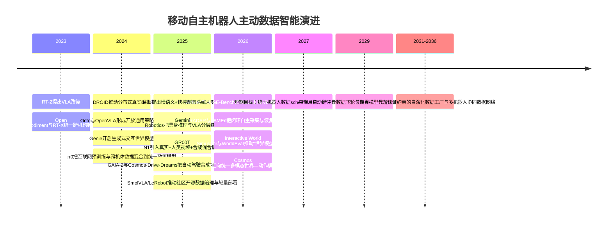

# 面向移动自主机器人的主动数据智能研究报告

> [!note] 整理说明
> 本版已清理下载报告中残留的引用控制符乱码（如 `cite/turn...` 私有字符），统一标题层级、元数据、目录与章节格式。原下载引用编号已失效，参考来源保留为可继续补链的清单。

## 目录

- [[#执行摘要|执行摘要]]
- [[#研究界定与核心判断|研究界定与核心判断]]
- [[#数据范式演进|数据范式演进]]
- [[#关键技术与方法图谱|关键技术与方法图谱]]
- [[#系统与架构设计|系统与架构设计]]
- [[#代表性系统与新范式|代表性系统与新范式]]
- [[#科学问题与未来路线|科学问题与未来路线]]
- [[#关键参考来源|关键参考来源]]

## 执行摘要

“主动数据智能”并不是给机器人再喂更多数据，而是让机器人系统具备**主动决定采什么、何时采、如何造、如何标、怎样评、何时回流再学**的能力。过去移动机器人与具身智能主要依赖静态数据集和离线训练；近两年则明显转向“数据飞轮”与“闭环系统”：一端以跨平台真实数据、自动标注、主动探索和在线适配提升现实覆盖，另一端以数字孪生、生成式世界模型、仿真—现实混合生成与闭环评测补足长尾场景与安全验证。2024年以来，OpenVLA、π0、Helix、Gemini Robotics、GR00T N1、SmolVLA、GAIA-2、Cosmos-Drive-Dreams、AirNav、HUGE-Bench、RADAR、TAMEn 等工作共同表明，机器人竞争焦点正从“模型参数”转向“数据生产系统”。未来五到十年，最有价值的能力不只是更强的策略模型，而是**可持续自演化的数据基础设施**：跨平台统一数据接口、可控生成世界、在线风险评估、分布式协同采集与合规治理。

## 研究界定与核心判断

本文将“面向移动自主机器人的主动数据智能”界定为一种**数据中心、闭环化、可操作的机器人智能范式**：数据不再只是训练输入，而成为由机器人、仿真器、世界模型、标注器、评测器和部署系统共同参与生产、筛选、组织、验证与再利用的动态资源。它面向的人形、四足、移动操作机器人、无人车、无人机等平台虽然形态不同，但都面临同一个核心矛盾：**真实世界分布宽、长尾极多、采集昂贵且高风险，而部署又要求低延迟、高鲁棒、可解释与可追责。**这正是静态数据集范式难以持续支撑的根本原因。

从发展脉络看，机器人学习大致经历了四次转移：其一，从单任务、单平台示教转向多任务、多平台数据汇聚；其二，从“离线训练一次用很久”转向“部署—失败—回流—再训练”的持续闭环；其三，从人工采集为主转向真实采集、仿真生成、世界模型生成、互联网视频/人类操作视频重定向的混合数据来源；其四，从单一策略模型转向“慢思考语义层 + 快控制执行层 + 世界模型/评测层 + 数据引擎层”的分层系统。RT-2 将互联网语义知识直接迁移到机器人控制，Open X-Embodiment/RT-X、DROID、Octo、OpenVLA 则把“跨机构、跨机器人”的大规模数据统一为通用训练底座；到了 2024—2026 年，π0、Helix、Gemini Robotics、GR00T N1 与 SmolVLA 又进一步把重点推进到跨形态泛化、低延迟部署和数据飞轮组织能力。

因此，本文的核心判断是：**主动数据智能不是机器人学习的辅助手段，而是未来移动自主机器人体系的“中枢基础设施”。**在项目申请或战略布局层面，真正的护城河将越来越体现在数据引擎能力——包括分布式采集、自动标注、主动合成、在线适配、闭环评测与安全治理——而不只是在模型本体。

## 数据范式演进

静态数据集阶段的典型代表，是 BridgeData V2、RT-2、Open X-Embodiment、DROID、Octo、OpenVLA 这一条路线。它们解决了机器人学习早期最大的瓶颈：数据规模太小、平台太碎、任务太窄。Open X-Embodiment 统一了 21 家机构、22 类机器人与数百技能的格式，并证明跨机器人正迁移是可行的；DROID 则把分布式采集推向“多采集者、多场景、长期收集”的真实世界组织化阶段；OpenVLA 和 Octo 进一步表明，大模型预训练之后可用更少域内数据快速适配新平台。也正因此，机器人开始从“为每个任务重训一个模型”转向“先有通用底座，再做小样本后训练”。

但静态范式很快暴露上限。首先，真实世界数据昂贵且偏态明显。Open X-Embodiment 后续的 OXE-AugE 直接指出，原始 OXE 在机器人形态分布上高度不均衡，前四类机体占超过 85% 的真实数据，容易造成对特定机体—场景组合的过拟合；其通过形态增广把数据扩展到 440 万条以上轨迹，并验证对未见机体与分布偏移均有提升。其次，真实采集难以覆盖长尾。π0、Helix、GR00T N1 都不再只依赖纯机器人日志，而是显式引入互联网视觉—语言预训练、自动生成文本标注、合成数据或多源混合训练。

由此出现第二阶段：**主动获取与组织数据。**这类系统不再被动接受已有数据，而是主动提高数据可用性。Helix 用 VLM 为遥操作视频自动生成 hindsight instruction；SmolVLA 进一步对社区数据中的任务文本进行自动补全，并把混乱的相机命名人工映射到统一视角协议；LeRobot 则把数据工具、机器人处理器、动作表示、仿真、RL 和人类在环采集放入同一开源框架，降低“采—训—测—部署”之间的接口摩擦。这里的关键变化是：**数据治理本身开始被算法化与工程化。**

第三阶段是**主动生成与闭环回流**。2025—2026 年，多项工作明确把“数据引擎”作为系统主语。RADAR 将语义任务生成、技能检索、执行与环境自动复位打通，形成无需持续人工介入的闭环数据采集；TAMEn 面向接触丰富任务，把精确示教、便携采集与恢复数据纳入“金字塔式”数据结构；RoboWheel 与 RoboPaint 则把人类手—物交互视频、触觉、重定向与仿真增强结合，证明人类视频可成为跨机体监督源；ReBot 通过 real-to-sim-to-real 视频合成，把真实轨迹带入仿真再回到真实视觉域，实现自动化域适配。这里的研究逻辑已经不是“我有什么数据”，而是“系统怎样持续制造更对当前策略有价值的数据”。

第四阶段正在形成，即**评价即数据、世界模型即数据工厂**。WorldEval 把世界模型用作真实策略的在线代理评测器；Interactive World Simulator 进一步展示，只用中等规模真实交互数据训练的交互式世界模型，就可以在模型内生成可用于训练的演示，并且其评测结果与真实世界高度相关。这意味着未来数据闭环将不只发生在“真实部署后回流”，而会大量发生在“世界模型内部的预演化”。

下面给出数据范式演进与未来里程碑时间线；其中 2024—2026 节点基于公开论文与官方资料，2027 之后为本文研判。

## 关键技术与方法图谱

主动数据智能的第一层是**主动感知与主动探索**。在移动机器人里，价值最高的数据往往不是随机采到的日志，而是位于失败边界、视角切换点、遮挡解除点和高风险决策点附近的片段。无人机方向的 AirNav、HUGE-Bench、UAV-Flow 已经显示出从“逐步路线跟随”向“高层命令—多阶段安全执行—细粒度短程反应式控制”的迁移：前者要求语言自然性和真实城市场景，后者强调过程指标、碰撞意识与高频控制。移动操作方向的 AnywhereVLA 也采取了类似思路：让 classical SLAM、任务感知前沿探索和局部 VLA 操作头相配合，把“走到哪儿找目标”和“到位后怎么操作”解耦。你提供的空中机器人资料也印证了这一演化——空中平台已经从传统 VLN 明显扩展到高层 VLA、Flow 控制、跟踪—接近—对齐与空中操作的连续链路。

第二层是**主动生成数据**。这已经成为 2024 年以来变化最快的方向。Cosmos World Foundation Model 将“数字孪生 + 视频整理 + 预训练世界模型 + 下游定制化世界模型”明确组合成平台；Cosmos-Transfer1 通过 segmentation、depth、edge 等可控输入支持 world-to-world transfer，直接面向 Sim2Real；Cosmos-Drive-Dreams 则把其进一步专门化到自动驾驶稀有场景生成。Wayve 的 GAIA-2 说明，自动驾驶正在把多视角一致、结构化条件控制、稀有场景多样化生成作为数据策略核心，而不是单纯扩大实车里程。对机器人操作而言，ReBot、RoboPaint、RoboWheel 则分别从真实轨迹回放、真人演示重定向、人类 HOI 视频重建三个方向证明：**合成数据不再只是补充，而是在主动数据智能体系中承担“分布增广器”和“低成本迁移器”的角色。**

第三层是**自监督、元学习、在线学习与后训练**。Gemini Robotics On-Device 显示，在具备通用基础知识后，新任务适配可压缩到 50—100 个示例；π0 则将“预训练像大模型、后训练像专用策略”的路径明确化；OMLA 用在线元学习适配器提升连续任务迁移效率；Action Flow Matching 直接对在线动作进行流匹配校正，以更高样本效率修正动态模型失配；GR-RL 又把通用 VLA 通过数据过滤、对称增广和在线 RL 继续打磨成高精度长时程专家。主动数据智能在这里体现为：**训练不再是一次性大批处理，而成为部署期持续发生的、带安全约束的模型更新过程。**

第四层是**世界模型与数字孪生**。Genie、Cosmos、Interactive World Simulator、WorldEval 说明，世界模型已经从“预测未来状态的辅助模块”升级为“训练场、评测场和数据场”的统一基础设施。对于无人车，它主要用来合成长尾交通场景并进行闭环安全验证；对于移动操作和人形，它则逐渐转化为行动前预演、策略筛选、危险动作阻断与在线代理评测。若再向前一步，世界模型将不只是模拟环境，而会成为整个数据飞轮的“中间件”，把真实日志、合成场景、失败重放、对抗测试和自动评分统一起来。

第五层是**数据治理、标注自动化、评价指标与安全性**。LeRobot 已把数据集工具、处理器、动作表示、仿真与人类在环采集纳入一体框架；SmolVLA 明确展示了自动生成任务描述和标准化相机视角的必要性；HUGE-Bench 采用过程导向与碰撞感知指标，标志着评测从只看终点成功率转向过程正确性与安全约束；Google DeepMind 在 Gemini Robotics 中则把低层安全控制器、语义安全评测和 ASIMOV 数据集并列为部署路径的一部分。治理层面，NIST AI RMF 与欧盟 AI Act 都强调风险评估、可追溯性、数据质量、人类监督和上市后监测，这会直接反过来约束机器人数据闭环的设计。

## 系统与架构设计

从系统工程角度，主动数据智能的最佳实践不是“单个超大模型”，而是**多层闭环架构**。典型链路包括：真实感知与遥操作/自主执行日志采集；数据清洗、切片、对齐、自动标注和异常挖掘；多源训练混合器；数字孪生/世界模型中的仿真补齐与长尾生成；代理评测与安全过滤；端侧/车载/机载部署；失败样本、风险样本与新任务样本回流。这个闭环的价值，在于把机器人从“静态训练产物”变成“面向数据不断自校准的运行系统”。

在接口设计上，未来系统的关键不是某一个模型 API，而是**跨平台统一数据协议**。Open X-Embodiment 通过标准格式让跨机构数据可训练，LeRobot 通过 dataset schema、robot processors、action representations 和 simulation hooks 让数据与训练工具链互通，OpenUSD/OpenUSD 联盟则为数字孪生、几何场景和物理对象的跨软件互操作提供行业底座。对于移动自主机器人，这意味着未来“相机、力觉、位姿、语言指令、世界模型条件、风险标记、评测事件”都必须能在统一数据层里被索引和回放，否则数据闭环无法工程化扩展。

在执行架构上，一个越来越明确的新共识是：**慢语义层与快控制层需解耦**。Helix 的 System 2 在 7–9Hz 做场景理解和语言理解，System 1 在 200Hz 输出上半身连续控制；Gemini Robotics-ER 面向空间理解、规划与代码生成，并与低层安全控制器对接；SmolVLA 采用异步推理，分离“理解与动作预测”和“动作执行”，以获得更快响应和更强恢复能力。这种双速率结构非常适合移动自主机器人，因为平台越移动、环境越动态，越不可能用一个统一大模型同时满足高语义泛化与毫秒级闭环控制。

下表给出不同移动机器人类别在主动数据智能上的需求差异。表中结论为基于近年公开文献的综合研判，重点反映数据类型、采集形态和风险约束如何塑造研究优先级。

| 机器人类别 | 主要数据类型 | 采集方式 | 实时性要求 | 仿真/数字孪生需求 | 主要风险 | 优先研究方向 |
|---|---|---|---|---|---|---|
| 人形机器人 | 多视角视觉、语言、关节状态、触觉/力觉、全身轨迹 | 遥操作、自动标注、失败回放、合成补齐 | 极高，需双速率甚至多速率控制 | 极高，需全身动力学与接触建模 | 跌倒、碰撞、接触失稳、人机安全 | 全身动作表示、恢复数据、触觉闭环、端侧部署  |
| 四足机器人 | 视觉、IMU、足端力、地形状态、任务指令 | 实地巡检、自主探索、少量示教、数字孪生 | 极高，强调姿态稳定与地形反应 | 高，需要地形、接触与扰动模拟 | 摔倒、滑移、复杂地形失稳 | 地形世界模型、在线适配、低功耗推理与安全恢复  |
| 移动操作机器人 | 导航日志、语义地图、腕部视觉、抓取/放置轨迹、力觉 | 导航自主采集+局部操作示教+世界模型补全 | 高，底盘与操作臂耦合 | 极高，需要场景几何与接触物理双重准确 | 长时程级联失败、误抓、碰撞 | 导航—操作解耦、任务图、主动探索、局部VLA后训练  |
| 无人车/自动驾驶 | 多相机、激光雷达、地图、轨迹、交互体状态、偏好反馈 | 海量车队日志、自动标注、长尾场景生成、闭环仿真 | 极高，车规实时 | 极高，决定长尾覆盖效率 | 生命安全、法规合规、责任归因 | 结构化世界模型、场景生成、偏好/RL后训练、安全案例化验证  |
| 无人机 | 俯视/斜视视觉、位姿、速度、语言指令、目标可见性 | 实飞采集、数字重建、仿真飞控、任务对话采集 | 极高，尤其短程反应式控制 | 高到极高，需视角变化与碰撞几何一致 | 坠机、失控、遮挡、通信失效 | 高层VLA、Flow控制、跟踪—接近—对齐、机载轻量模型  |
| 广义具身智能体 | 视觉、语言、视频、人类操作视频、互联网知识、跨模态记忆 | 真实+仿真+互联网视频+多机体重定向 | 从中到高，取决于是否闭环控制 | 极高，需要可控多模态世界 | 幻觉、分布漂移、不可解释决策 | 统一世界—动作模型、跨机体重定向、检索增强与治理框架  |

## 代表性系统与新范式

若把 2024 年以来的代表性方向放在同一张图里看，会发现一个非常清晰的趋势：**具身智能系统正在从“模型中心”转向“数据中心”，再进一步转向“数据—模型—评测一体化中心”。**OpenVLA 是开放通用 VLA 的起点性工作；π0 把互联网 VLM 预训练、Open X 数据和自建高质量跨机体操作数据混成统一训练配方；SmolVLA 则说明在轻量模型、开放社区数据和异步推理条件下，也能形成可复制的通用基线。它们共同把主动数据智能推进到“开放底座 + 少量后训练 + 低成本复现实验”的阶段。

在人形及复杂具身平台上，Helix、Gemini Robotics、GR00T N1 是三个最具代表性的 2025 节点。Helix 的标志意义在于将慢速语义推理和 200Hz 高速控制显式拆分，并通过自动生成文本标注降低语言监督成本；Gemini Robotics 把具身推理模型 ER 和直接输出动作的 VLA 结合，并将安全、语义评测与低层控制器纳入同一叙事；GR00T N1 则把真实机器人轨迹、人类视频和合成数据组合成异构训练数据配方。它们的共性非常突出：**谁能更高效地组织异构数据，谁就更可能在复杂机体和复杂场景上形成先发优势。**

在移动平台与无人系统上，新范式同样明显。无人机方向，AirNav 从真实城市航拍中构建大规模自然指令数据，HUGE-Bench 用 3DGS-Mesh 数字孪生和过程导向指标测试高层飞行任务，UAV-Flow 则把语言引导短程飞行控制定义为独立基准。自动驾驶方向，GAIA-2 与 Cosmos-Drive-Dreams 说明数据策略已经从“尽量多开车”转向“可控生成多视角一致的长尾场景”；Poutine 则把自监督 VLT 预训练、自动生成语言注释和小规模偏好/强化后训练结合起来，表明主动数据智能也正在进入车规级 end-to-end 驾驶模型。

更值得注意的是，**Agent 化系统正在改变数据闭环的控制逻辑**。过去是人定义任务、采数据、训练模型；现在越来越多系统开始由模型自己发现数据缺口。RADAR 可以语义生成任务并自动复位环境；Gemini Robotics-ER 可以把感知、状态估计、规划与代码生成串联起来；世界模型则在内部对策略进行“先试后上”。这意味着不久后的主动数据智能，可能由一个“数据 Agent”主导：自动发现失败模式、调用仿真器合成长尾、调用标注器补文本、调用评测器验证收益，再决定是否进入真实机采集。

## 科学问题与未来路线

从科学问题看，主动数据智能至少还有六个未解难点。第一，**样本效率**仍不足。虽然基础模型降低了新任务学习成本，但复杂接触、长时程条件依然需要高质量后训练数据。第二，**长期自主学习**仍缺乏可靠机制，持续更新容易带来遗忘和安全回退。第三，**分布式数据协同**尚未形成成熟范式，跨机构、跨平台、跨隐私边界的统一标准仍然不足。第四，**可解释性**在高维动作模型中依旧薄弱，尤其在人形和无人车这种安全关键系统上。第五，**鲁棒性与恢复能力**还未成为主流 benchmark 的核心指标。第六，**伦理与法规**正在从外围问题变成系统设计约束。

结合现有技术成熟度，未来一年的优先级应放在“三件事”上：一是统一数据 schema、任务文本协议、相机/状态命名与评测事件记录方式；二是把自动标注、失败样本挖掘和仿真补齐做成工具链，而不是孤立论文；三是以小样本后训练和异步推理支撑端侧可部署模型。这个阶段最现实的目标，不是造完全自主的一般机器人，而是让每个平台都具备基本的数据回流和再训练能力。

未来三年，关键里程碑将转向**跨平台通用数据飞轮**。届时较成熟的路线应包括：世界模型代理评测进入主训练链路；真实平台与数字孪生形成同步更新；跨形态重定向数据被常规化使用；移动平台采用“几何导航/探索 + 局部操作 VLA”的混合架构；安全评测从单点成功率变成“任务成功 + 风险暴露 + 可恢复性 + 合规证据”的复合指标。对于企业，这意味着数据平台部门的重要性会接近甚至超过单一模型团队。

五到十年尺度上，最值得押注的方向有四个。其一，**统一世界—动作模型**，将理解、生成、规划、评测和控制纳入同一多模态基座，Cosmos 3 与 Motus 已给出雏形。其二，**具备认证约束的数字孪生**，让世界模型不仅用于训练，还能进入安全案例和法规合规流程。其三，**分布式多机器人数据网络**，让人形、四足、无人车、无人机与移动操作平台通过共享表征而不是共享动作空间协同学习。其四，**跨学科融合**，包括认知科学、控制理论、计算机图形学、HCI、法规工程和安全工程。真正成熟的主动数据智能，不会是某一学科的线性延伸，而会是机器人系统工程的一次整体重构。

从产业化路径看，短中期最可能率先落地的不是“家庭通用人形”这种终局形态，而是**半结构化高价值场景**：仓储与分拣、工业上下料、园区配送、无人巡检、低空任务执行、港口/矿区无人运输、受限场景自动驾驶。原因很简单：这些场景既有足够数据闭环空间，又能通过数字孪生和重复业务流程验证主动数据智能带来的 ROI。谁先建立可扩展的数据平台，谁就更可能形成真正可复用的机器人操作系统。

## 关键参考来源

以下来源优先选取 2022 年以来的原始论文、官方技术报告与权威机构页面；其中中文原始资料相对有限，因此以英文原始来源为主，中文补充材料为辅。

- Open X-Embodiment Collaboration, **Open X-Embodiment: Robotic Learning Datasets and RT-X Models**, 2023。
- Dibya Ghosh 等，**Octo: An Open-Source Generalist Robot Policy**, 2024。
- Moo Jin Kim 等，**OpenVLA: An Open-Source Vision-Language-Action Model**, 2024。
- OpenVLA 前史：Anthony Brohan 等，**RT-2: Vision-Language-Action Models Transfer Web Knowledge to Robotic Control**, 2023。
- DeepMind/Google，**Gemini Robotics** 官方博客与技术报告，2025。
- Google DeepMind，**Gemini Robotics On-Device** 官方博客，2025。
- Figure AI，**Helix: A Vision-Language-Action Model for Generalist Humanoid Control**, 官方页面，2025。
- NVIDIA，**GR00T N1: An Open Foundation Model for Generalist Humanoid Robots**, 2025。
- NVIDIA，**Cosmos World Foundation Model Platform for Physical AI**、**Cosmos-Transfer1**、**Cosmos-Drive-Dreams**，2025。
- Wayve，**GAIA-2: A Controllable Multi-View Generative World Model for Autonomous Driving**, 2025。
- Physical Intelligence，**π0: Our First Generalist Policy**，官方博客与论文，2024。
- Hugging Face，**LeRobot** 文档与 **SmolVLA** 官方博客，2025。
- DROID 数据集，**A Large-Scale In-The-Wild Robot Manipulation Dataset**, 2024。
- RADAR、TAMEn、RoboWheel、ReBot、Interactive World Simulator、WorldEval 等数据引擎与世界模型闭环工作，2025—2026。
- 无人机方向：**AirNav**、**HUGE-Bench**、**UAV-Flow Colosseo**，以及你提供的空中机器人资料整理（作为补充参考，正文以原始论文为主）。
- 治理与合规：NIST **AI Risk Management Framework**；欧盟委员会 **AI Act** 官方页面。

## 后续完善待办

- [ ] 为“关键参考来源”逐条补充可点击 DOI、arXiv、官方博客或项目主页链接。
- [ ] 对 2025—2026 年的模型与系统（Gemini Robotics、GR00T N1、Cosmos、SmolVLA、AirNav、RADAR、TAMEn 等）做一次最新公开资料复核。
- [ ] 将“机器人类别需求差异”表格拆分为项目申请可复用版本：科学问题、技术路线、指标体系、预期成果。
- [ ] 补充 AirSpark 自身场景映射：低空/移动平台的数据闭环、仿真闭环、评测闭环和安全治理闭环。
